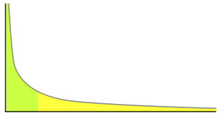

幂次定律 —— Power Law
==========================

如果某件事的发生频率和它的某个属性成幂关系，那么这个频率就可以称之为符合幂次定律。

幂次定律的表现是，
*少数几个事件的发生频率占了整个发生频率的大部分， 而其余的大多数事件只占整个发生频率的一个小部分*\ ，
如图：

   右边黄色为长尾，左边绿色为占主宰地位的少数事件。（图片来源于维基百科）

详细信息请参考维基百科的 `Power Law 词条 <http://en.wikipedia.org/wiki/Power_law>`_ 。

MMDays 博客的\ `《淺談網路世界的Power Law現象》 <http://mmdays.com/2008/11/22/power_law_1/>`_\ 一系列文章也是很好的资料。

应用示例
---------

在 Redis 的 ``t_zset.c`` 模块中，跳跃表层数的随机值就由符合幂次定律的函数定义，
数值越大，函数生成它的几率就越小：

.. code-block:: c

    /* Returns a random level for the new skiplist node we are going to create.
     * The return value of this function is between 1 and ZSKIPLIST_MAXLEVEL
     * (both inclusive), with a powerlaw-alike distribution where higher
     * levels are less likely to be returned.
     *
     * 返回一个介于 1 和 ZSKIPLIST_MAXLEVEL 之间的随机值，作为节点的层数。
     */
    #define ZSKIPLIST_P 0.25
    #define ZSKIPLIST_MAXLEVEL 32
    int zslRandomLevel(void) {
        int level = 1; 
        while ((random()&0xFFFF) < (ZSKIPLIST_P * 0xFFFF))
            level += 1;
        return (level<ZSKIPLIST_MAXLEVEL) ? level : ZSKIPLIST_MAXLEVEL;
    }
