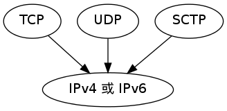

第 2 章：传输层：TCP 、 UDP 和 SCTP
==============================================

本章介绍的\ **传输层**\ 包括：

- UDP ：简单、不可靠的数据报协议

- TCP ：复杂、可靠的字节流协议

- SCTP ：和 TCP 一样，是一个可靠的传输协议，但它还提供消息边界、传输级别多宿（multihoming）支持，以及将头端阻塞（head-of-line blocking）减少到最小的一种方法。

以上协议层都转而使用\ **网络层**\ 协议 IP ，或是 IPv4 ，或是 IPv6 ：

协议简介
-----------

IPv4
^^^^^^^^^

全名：网际协议版本 4 （Internet Protocol version 4）。

- 自 80 年代早期以来的主要网际协议。

- 使用 32 位地址。

- 为 TCP 、 UDP 、 SCTP 、 ICMP 和 IGMP 提供分组递送服务。

IPv6
^^^^^^^^^

全名：网际协议版本 6 （Internet Protocol version 6).

- 20 世纪 90 年代中期作为 IPv4 的替代品而设计。

- 使用 128 位地址，以应对网络的爆发性增长。

- 为 TCP 、 UDP 、 SCTP 和 ICMPv6 提供分组递送服务。

UDP
^^^^^^

全名：用户数据报协议（User Datagram Protocol）。

- 一种无连接协议。

- UDP 套接字是一种数据报套接字。

- UDP 数据报不能保证最终到达它们的目的地。

- 和 TCP 一样，既可以用 IPv4 也可以用 IPv6 。

SCTP
^^^^^^^^

全名：流控制传输协议（Stream Control Transmission Protocol）。

- 提供可靠全双工关联的面向连接的协议。

- 提供消息服务，也就是维护来自应用层的记录边界。

- 既可以用 IPv4 也可以用 IPv6 ，而且能够在同一个关联中同时使用它们。

.. note:: 关联

    我们使用关联一词来指称 SCTP 中的链接，
    因为 SCTP 是多宿的，
    从而每个关联的两端涉及一组 IP 地址和一个端口号。

更多其他协议
^^^^^^^^^^^^^^^^

书本还介绍了 ICMP 、 IGMP 、ARP 等协议，
具体参考书本。

UDP 协议
-----------

从创建到发送 UDP 包的过程如下：

1. 应用程序往 UDP 套接字写域一个消息

2. 消息被封装到一个 UDP 数据报

3. UDP 数据报又被封装到一个 IP 数据报

4. 将 IP 送据报发送至目的地

UDP 协议的特点：

- 不保证 UDP 数据报会到达其最终目的地

- 不保证各个数据报的先后顺序跨网络后保持不变

- 不保证每个数据报只到达一次

- 每个 UDP 数据报都有一个长度

- 提供无连接服务： UDP 客户和服务器之间不必存在任何长期关系。

缺点 —— 缺乏可靠性：

- 发送的过程中没有安全保证，出错也不会被源端（source）自动重传

- 要确保一个数据报到达目的地，需要添加很多额外的特性

TCP 协议
----------------

特点：

- 连接：TCP 客户先与某个给定服务器建立一个连接，再跨该连接与服务器交换数据。

- 可靠性：当向另一端发送数据时，要求对端返回一个确认。如果没有收到确认，就重新发送并等待更长事件。TCP 会动态估算客户端和服务器之间的往返时间，知道应该等待多少时间。

- 排序：对数据进行排序，以避免数据重复和混乱。

- 流量控制：总是告知对端它一次能够接收多少字节，确保发送端发送的数据不会使接收缓冲区溢出。

- 全双工：在一个给定的连接上，应用可以在任何时刻，在进出两个方向上既发送数据又接收数据。

SCTP
--------

特点：

- 在客户端和服务器之间提供关联：使用关联(association)而不是连接(connection)，是因为一个关联指代两个系统之间的一次通讯，它可能因为 SCTP 支持多宿而设计不止两个地址。

- 面向消息：提供按序投递服务。和 UDP 一样，由发送端写入每条记录的长度，并随数据一同传递给接收端。

- 在端点之间提供多个流：每个流各自可靠地按序递送消息。一个流上某个消息的丢失不会阻塞同意关联其他流上的信息投递（TCP 在单个字节流中任何位置的字节丢失都将阻塞该连接上的所有数据的递送，直到该丢失数据被修复为止）。

- 多宿：单个 SCTP 端点能够支持多个 IP 地址，可以通过切换地址来避免故障，增强健壮性。

