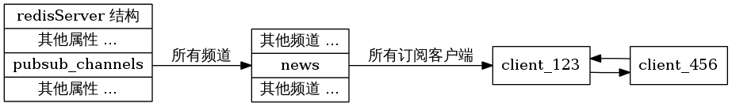
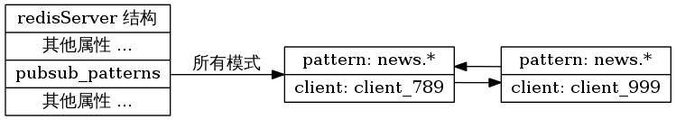

.. highlight:: c

发布/订阅
============

Redis 通过 `PUBLISH <http://redis.readthedocs.org/en/latest/pub_sub/publish.html>`_ 、 `SUBSCRIBE <http://redis.readthedocs.org/en/latest/pub_sub/subscribe.html>`_ 和 `PSUBSCRIBE <http://redis.readthedocs.org/en/latest/pub_sub/psubscribe.html>`_ 等命令实现发布和订阅功能。

这些命令被广泛用于构建即时通信应用，比如网络聊天室（chatroom）和实时广播、实时提醒等。

本文通过分析 Redis 源码里的 ``pubsub.c`` 文件，了解发布和订阅机制的底层实现，籍此加深对 Redis 的理解。

订阅、发布和退订
----------------------------------------

在开始研究源码之前，不妨先来回顾一下几个相关命令的使用方式。

``PUBLISH`` 命令用于向给定的频道发送信息，返回值为接收到信息的订阅者数量：

::

    redis> PUBLISH treehole "top secret here ..."
    (integer) 0

    redis> PUBLISH chatroom "hi?"
    (integer) 1

``SUBSCRIBE`` 命令订阅给定的一个或多个频道：

::

    redis> SUBSCRIBE chatroom
    Reading messages... (press Ctrl-C to quit)
    1) "subscribe"  # 订阅反馈
    2) "chatroom"   # 订阅的频道
    3) (integer) 1  # 目前客户端已订阅频道/模式的数量

    1) "message"    # 信息
    2) "chatroom"   # 发送信息的频道
    3) "hi?"        # 信息内容

``SUBSCRIBE`` 的返回值当中， ``1)`` 为 ``subscribe`` 的是订阅的反馈信息，而 ``1)`` 为 ``message`` 的则是订阅的频道所发送的信息。

``SUBSCRIBE`` 还可以订阅多个频道，这样一来它接收到的信息就可能来自多个频道：

::

    redis> SUBSCRIBE chatroom talk-to-jack
    Reading messages... (press Ctrl-C to quit)
    1) "subscribe"          # 订阅 chatroom 的反馈
    2) "chatroom"
    3) (integer) 1

    1) "subscribe"          # 订阅 talk-to-jack 的反馈
    2) "talk-to-jack"
    3) (integer) 2

    1) "message"            # 来自 chatroom 的消息
    2) "chatroom"
    3) "yahoo"

    1) "message"            # 来自 talk-to-peter 的消息
    2) "talk-to-jack"
    3) "Goodmorning, peter."

``PSUBSCRIBE`` 提供了一种订阅符合给定模式的所有频道的方法，比如说，使用 ``it.*`` 为输入，就可以订阅所有以 ``it.`` 开头的频道，比如  ``it.news`` 、 ``it.blog`` 、 ``it.tweets`` ，诸如此类：

::

    redis> PSUBSCRIBE it.*
    Reading messages... (press Ctrl-C to quit)
    1) "psubscribe"
    2) "it.*"
    3) (integer) 1

    1) "pmessage"
    2) "it.*"                   # 匹配的模式
    3) "it.news"                # 消息的来源频道
    4) "Redis 2.6rc5 release"   # 消息内容

    1) "pmessage"
    2) "it.*"
    3) "it.blog"
    4) "Why NoSQL matters"

    1) "pmessage"
    2) "it.*"
    3) "it.tweet"
    4) "@redis: when will the 2.6 stable release?"

当然， ``PSUBSCRIBE`` 也可以接受多个参数，从而匹配多种模式。

最后， `UNSUBSCRIBE <http://redis.readthedocs.org/en/latest/pub_sub/unsubscribe.html>`_ 命令和 `PUNSUBSCRIBE <http://redis.readthedocs.org/en/latest/pub_sub/punsubscribe.html>`_ 负责退订给定的频道或模式。

发布和订阅机制
-----------------------------

当一个客户端通过 ``PUBLISH`` 命令向订阅者发送信息的时候，我们称这个客户端为发布者（publisher）。

而当一个客户端使用 ``SUBSCRIBE`` 或者 ``PSUBSCRIBE`` 命令接收信息的时候，我们称这个客户端为订阅者（subscriber）。

为了解耦发布者（publisher）和订阅者（subscriber）之间的关系，Redis 使用了 channel （频道）作为两者的中介 ——  发布者将信息直接发布给 channel ，而 channel 负责将信息发送给适当的订阅者，发布者和订阅者之间没有相互关系，也不知道对方的存在：

.. image:: pubsub/pubsub.png

知道了发布和订阅的机制之后，接下来就可以开始研究具体的实现了，我们从 Redis 的订阅命令开始说起。

SUBSCRIBE 命令的实现
----------------------------

前面说到，Redis 将所有接受和发送信息的任务交给 channel 来进行，而所有 channel 的信息就储存在 ``redisServer`` 这个结构中：

::

    struct redisServer {
        // 省略 ...
        dict *pubsub_channels;  // Map channels to list of subscribed clients
        // 省略 ... 
    };

``pubsub_channels`` 是一个字典，字典的键就是一个个 channel ，而字典的值则是一个链表，链表中保存了所有订阅这个 channel 的客户端。

举个例子，如果在一个 ``redisServer`` 实例中，有一个叫做 ``news`` 的频道，这个频道同时被 ``client_123`` 和 ``client_456`` 两个客户端订阅，那么这个 ``redisServer`` 结构看起来应该是这样子：

可以看出，实现 ``SUBSCRIBE`` 命令的关键，就是将客户端添加到给定 ``channel`` 的订阅链表中。

函数 ``pubsubSubscribeChannel`` 是 ``SUBSCRIBE`` 命令的底层实现，它完成了将客户端添加到订阅链表中的工作：

::

    // 订阅指定频道
    // 订阅成功返回 1 ，如果已经订阅过，返回 0 
    int pubsubSubscribeChannel(redisClient *c, robj *channel) {
        struct dictEntry *de;
        list *clients = NULL;
        int retval = 0;

        /* Add the channel to the client -> channels hash table */
        // dictAdd 在添加新元素成功时返回 DICT_OK
        // 因此这个判断句表示，如果新订阅 channel 成功，那么 。。。
        if (dictAdd(c->pubsub_channels,channel,NULL) == DICT_OK) {
            retval = 1;
            incrRefCount(channel);

            /* Add the client to the channel -> list of clients hash table */
            // 将 client 添加到订阅给定 channel 的链表中
            // 这个链表是一个哈希表的值，哈希表的键是给定 channel
            // 这个哈希表保存在 server.pubsub_channels 里
            de = dictFind(server.pubsub_channels,channel);
            if (de == NULL) {
                // 如果 de 等于 NULL 
                // 表示这个客户端是首个订阅这个 channel 的客户端
                // 那么创建一个新的列表， 并将它加入到哈希表中
                clients = listCreate();
                dictAdd(server.pubsub_channels,channel,clients);
                incrRefCount(channel);
            } else {
                // 如果 de 不为空，就取出这个 clients 链表
                clients = dictGetVal(de);
            }
            // 将客户端加入到链表中
            listAddNodeTail(clients,c);
        }
        /* Notify the client */
        addReply(c,shared.mbulkhdr[3]);
        addReply(c,shared.subscribebulk);
        // 返回订阅的频道
        addReplyBulk(c,channel);    
        // 返回客户端当前已订阅的频道和模式数量的总和
        addReplyLongLong(c,dictSize(c->pubsub_channels)+listLength(c->pubsub_patterns));    

        return retval;
    }

PSUBSCRIBE 命令的实现
-------------------------

除了直接订阅给定 channel 外，还可以使用 ``PSUBSCRIBE`` 订阅一个模式（pattern），订阅一个模式等同于订阅所有匹配这个模式的 channel 。

和 ``redisServer.pubsub_channels`` 属性类似， ``redisServer.pubsub_patterns`` 属性用于保存所有被订阅的模式，和 ``pubsub_channels`` 不同的是， ``pubsub_patterns`` 是一个链表（而不是字典）：

::

    struct redisServer {
        // 省略 ...
        list *pubsub_patterns;  // A list of pubsub_patterns
        // 省略 ... 
    };

``pubsub_patterns`` 的每一个节点都是一个 ``pubsubPattern`` 结构的实例，它保存了被订阅的模式，以及订阅这个模式的客户客户端：

::

    typedef struct pubsubPattern {
        redisClient *client;
        robj *pattern;
    } pubsubPattern;

举个例子，假设在一个 ``redisServer`` 实例中，有一个叫做 ``news.*`` 的模式同时被客户端 ``client_789`` 和 ``client_999`` 订阅，那么这个 ``redisServer`` 结构看起来应该是这样子：

现在可以知道，实现 ``PSUBSCRIBE`` 命令的关键，就是将客户端和订阅的模式添加到 ``redisServer.pubsub_patterns`` 当中。

``pubsubSubscribePattern`` 是 ``PSUBSCRIBE`` 的底层实现，它将客户端和所订阅的模式添加到 ``redisServer.pubsub_patterns`` 当中：

::

    // 订阅指定模式
    // 订阅成功返回 1 ，如果已经订阅过，返回 0 
    int pubsubSubscribePattern(redisClient *c, robj *pattern) {
        int retval = 0;

        // 向 c->pubsub_patterns 中查找指定 pattern
        // 如果返回值为 NULL ，说明这个 pattern 还没被这个客户端订阅过
        if (listSearchKey(c->pubsub_patterns,pattern) == NULL) {
            retval = 1;

            // 添加 pattern 到客户端 pubsub_patterns
            listAddNodeTail(c->pubsub_patterns,pattern);    
            incrRefCount(pattern);

            // 将 pattern 添加到服务器
            pubsubPattern *pat;
            pat = zmalloc(sizeof(*pat));
            pat->pattern = getDecodedObject(pattern);
            pat->client = c;

            listAddNodeTail(server.pubsub_patterns,pat);
        }
        /* Notify the client */
        addReply(c,shared.mbulkhdr[3]);
        addReply(c,shared.psubscribebulk);
        // 返回被订阅的模式
        addReplyBulk(c,pattern);    
        // 返回客户端当前已订阅的频道和模式数量的总和
        addReplyLongLong(c,dictSize(c->pubsub_channels)+listLength(c->pubsub_patterns));    

        return retval;
    }

PUBLISH 命令的实现
-------------------

使用 ``PUBLISH`` 命令向订阅者发送消息，需要执行以下两个步骤：

1) 使用给定的频道作为键，在 ``redisServer.pubsub_channels`` 字典中查找记录了订阅这个频道的所有客户端的链表，遍历这个链表，将消息发布给所有订阅者。

2) 遍历 ``redisServer.pubsub_patterns`` 链表，将链表中的模式和给定的频道进行匹配，如果匹配成功，那么将消息发布到相应模式的客户端当中。

举个例子，假设有两个客户端分别订阅 ``it.news`` 频道和 ``it.*`` 模式，当执行命令 ``PUBLISH it.news "hello moto"`` 的时候， ``it.news`` 频道的订阅者会在步骤 1 收到信息，而当 ``PUBLISH`` 进行到步骤 2 的时候， ``it.*`` 模式的订阅者也会收到信息。

``PUBLISH`` 命令的实际实现由 ``pubsubPublishMessage`` 函数完成，它的完整定义如下：

::

    // 发送消息
    int pubsubPublishMessage(robj *channel, robj *message) {
        int receivers = 0;
        struct dictEntry *de;
        listNode *ln;
        listIter li;

        /* Send to clients listening for that channel */
        // 向所有频道的订阅者发送消息
        de = dictFind(server.pubsub_channels,channel);
        if (de) {
            list *list = dictGetVal(de);    // 取出所有订阅者
            listNode *ln;
            listIter li;

            // 遍历所有订阅者， 向它们发送消息
            listRewind(list,&li);
            while ((ln = listNext(&li)) != NULL) {
                redisClient *c = ln->value;

                addReply(c,shared.mbulkhdr[3]);
                addReply(c,shared.messagebulk);
                addReplyBulk(c,channel);    // 打印频道名
                addReplyBulk(c,message);    // 打印消息
                receivers++;    // 更新接收者数量
            }
        }
        /* Send to clients listening to matching channels */
        // 向所有被匹配模式的订阅者发送消息
        if (listLength(server.pubsub_patterns)) {
            listRewind(server.pubsub_patterns,&li); // 取出所有模式
            channel = getDecodedObject(channel);
            while ((ln = listNext(&li)) != NULL) {
                pubsubPattern *pat = ln->value; // 取出模式

                // 如果模式和 channel 匹配的话
                // 向这个模式的订阅者发送消息
                if (stringmatchlen((char*)pat->pattern->ptr,
                                    sdslen(pat->pattern->ptr),
                                    (char*)channel->ptr,
                                    sdslen(channel->ptr),0)) {
                    addReply(pat->client,shared.mbulkhdr[4]);
                    addReply(pat->client,shared.pmessagebulk);
                    addReplyBulk(pat->client,pat->pattern); // 打印被匹配的模式
                    addReplyBulk(pat->client,channel);      // 打印频道名
                    addReplyBulk(pat->client,message);      // 打印消息
                    receivers++;    // 更新接收者数量
                }
            }
            decrRefCount(channel);  // 释放用过的 channel
        }
        return receivers;   // 返回接收者数量
    }

UNSUBSCRIBE 和 PUNSUBSCRIBE 的实现
---------------------------------------

``UNSUBSCRIBE`` 和 ``PUNSUBSCRIBE`` 分别是 ``SUBSCRIBE`` 和 ``PSUBSCRIBE`` 的反操作，如果明白了 ``SUBSCRIBE`` 和 ``PSUBSCRIBE`` 的工作机制的话，应该不难理解这两个反操作的原理，所以这里就省略详细的分析了，有兴趣的可以直接看代码。

小节
------

Redis 的 pubsub 机制的分析就到此结束了，跟往常一样，带有注释的完整 ``pubsub.c`` 文件可以到我的 GITHUB 上找： `https://github.com/huangz1990/reading_redis_source <https://github.com/huangz1990/reading_redis_source>`_ 。

Have fun 。
