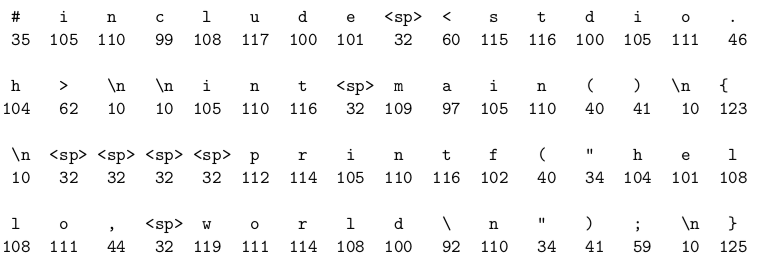
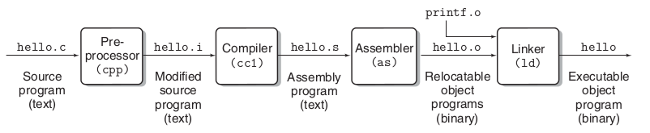
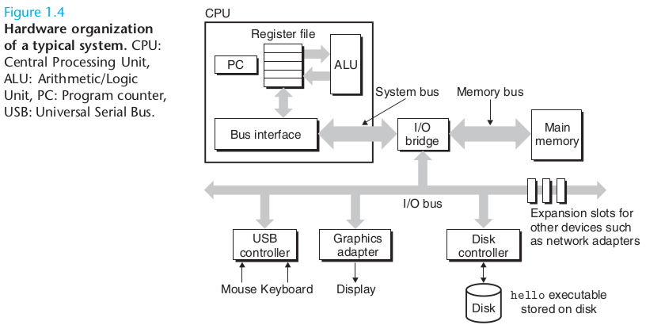
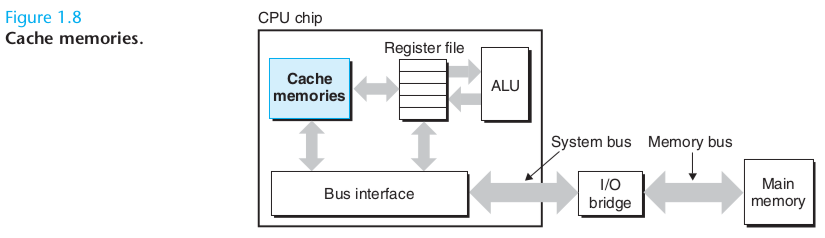
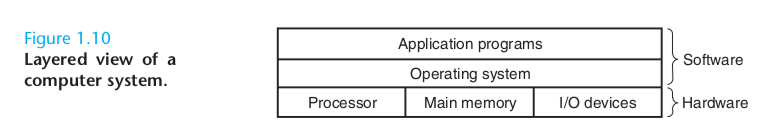
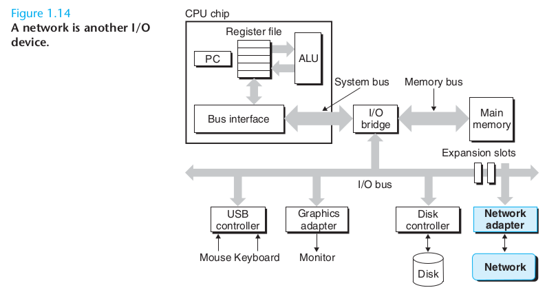

第一章： 计算系统简介
===============================================

为什么阅读本书？

- 了解计算机的底层运作方式

- 识别、避免、处理因为不了解底层而引发的各种错误

- 利用底层设计，写出更高效的程序

1.1 信息就是位和上下文(context)
--------------------------------------------

.. code-block:: c

    // hello.c

    #include <stdio.h>

    int main()
    {
        printf("hello, world\n");
    }

以下是 ``hello.c`` 的 ASCII 文本表示：

- ``hello.c`` 可以被称为源文件，或者源程序，
  它由一系列位组成，
  每个位的值可以是 ``0`` 或者 ``1`` ，
  每 8 个位组成一个块（chunk），
  每个字节都表示了源文件中的某个字符。

- 大多数现代系统都使用 ASCII 标识来表示字符，
  在这个标准中，
  每个字符都被表示成长度为一个字节的、不相同（unique）的整数。

- 一个只包含 ASCII 字符的文件被称为文本文件，
  而其他所有文件都被称为二进制文件。

----

- 系统中的所有信息 ——
  包括磁盘文件，内存中的程序，内存中的用户数据，
  通过网络传送的数据，等等，
  都是由一系列字节来表示的。

- 不同数据对象的区别在于，我们在什么上下文中处理它们。

- 比如说，
  在不同的上下文中，
  同样的一串字节可能会被表示为整数、浮点数、字符串、或者机器指令。

1.2 源码由程序转换为不同的格式
---------------------------------

- C 语言是高层次的，它可以被人类阅读和理解。

- 但是为了在系统中执行这个 C 程序，
  我们必须使用一些程序，
  将这个 C 程序转换为一串低层次 *机器语言* 指令。

- 这些机器指令之后会被打包为一个 *可执行对象程序* ，并保存为二进制文件。

- 对象程序通常也被成为 *可执行对象文件* 。

----

以下是将一个 ``hello.c`` 源程序翻译为一个可执行二进制文件 ``hello`` 的步骤：

::

    unix> gcc -o hello hello.c

以下是 gcc 翻译文件的过程，
以及翻译涉及的程序：

翻译总共由四个程序执行，
它们总称为编译系统（compilation system），
分别是：
预处理器（preprocessor）、
编译器（complier）、
汇编器（assembler）、
链接器（linker）。

这四个程序进行翻译的四个阶段分别是：

- 预处理阶段：
  根据 ``#`` 命令，
  对源码进行处理（插入、替换，等等）。

- 编译阶段：
  将程序翻译成汇编语言。

- 汇编阶段：
  将汇编翻译成机器语言，
  并打包成一个可重载对象程序（relocatable object program）。

- 链接阶段：
  将预编译文件合并到可重载对象程序里面，
  并产生一个可执行对象文件（executable object file）。

1.3 理解编译系统的运行是有益的
---------------------------------

无

1.4 处理器读入并执行保存在内存里的指令
-------------------------------------------

当我们在终端中执行 ``hello`` 程序时，
将获得以下结果：

::

    unix> ./hello
    hello, world
    unix>

要理解系统如何执行这个程序，
并产生输出，
我们需要了解系统的硬件组织。

1.4.1 系统的硬件组织
^^^^^^^^^^^^^^^^^^^^^^^^^

以下是典型的系统结构组织图：

bus （总线）
""""""""""""""""

- 连接各个部件的电子管道，负责在各个部件中传送数据。

- 通常以字（word）为单位传送数据，字通常是固定大小的。

- 现代机器的字一般是 4 字节（32 位）或 8 字节（64 位）。

I/O devices（输入/输出设备）
"""""""""""""""""""""""""""""""

- 输入/输出设备是系统连接系统和外界

- 每个 I/O 设备都通过 I/O 总线连接到一个控制器（controller）或是适配器（adapter）上面。

- 控制器和适配器之间的差别是：

  - 控制器是设备本身带有的、或是主板（motherboard）附带的芯片组。

  - 适配器则是通过主板接口插入到系统的。

  不过它们都同样用于在 I/O 总线和 I/O 设备之间传送数据。

main memory（主存）
"""""""""""""""""""""""""""""""

- 临时性的储存设备，
  持有处理器正在执行的程序的代码和数据（program and the data）。

- 物理上，由一系列动态随机存储内存（dynamic random access memory，DRAM）组成。

- 逻辑上，内存被组织为一个线性的字节数组，每个字节都带有自己的唯一（unique）地址（数组索引），索引以 ``0`` 开始。

- 一条机器指令通常涉及不定数量的字节，
  比如在 32 位 Linux 上的 C 语言中，
  ``short`` 类型数据的长度为 ``2`` 字节，
  ``int`` 、 ``float`` 和 ``long`` 都是 ``4`` 字节，
  等等。

processor（处理器）
""""""""""""""""""""""""""""""

- 中央处理器（central processing unit，CPU），
  简称处理器（processor)，
  是执行保存在主存中的命令的引擎。

- 处理器中有一个字长度（word-size）的寄存器，
  称为程序计数器（program counter， PC）：
  在任何时间中，
  PC 都指向主存中的某个地址，
  这些地址保存了某些机器语言指令。

- 从系统通电开始，
  直到停电为止，
  处理器就一直执行以下动作：

  - 执行 PC 所指向地址里保存的指令

  - 更新 PC 的地址

- 处理器要执行的指令非常简单，
  这个指令集由指令集架构（instruction set architecture）定义，
  这些操作通常都与主存、寄存器文件或是 ALU 有关。

- 处理器还包含一些寄存器文件（register file）和 ALU （算术/逻辑单元）：

  - 寄存文件由一集保存字长度数据的寄存器组成。

  - ALU 用于计算新数据，和新地址。

- 以下是几个常用的指令：

  - 载入：从内存中复制一个字节或是一个字长的数据到寄存器，覆盖寄存器原来的值。

  - 保存：将寄存器中的一个字节或是一个字长的数据复制到内存的某个位置，覆盖该位置原有的值。

  - 计算：取出两个寄存器的值，复制它们到 ALU ，然后 ALU 对这两个值进行计算，并将结果保存在某个寄存器中，覆盖该寄存器原来的值。

  - 跳转：从指令中取出一个字，并将该字放到 PC 上，覆盖 PC 原来的值。

1.4.2 运行 ``hello`` 程序
^^^^^^^^^^^^^^^^^^^^^^^^^^^^^^^^

当我们在命令行输入 ``./hello`` 的时候，
底层硬件执行以下步骤：

1. 从键盘读入命令到寄存器，并将命令保存到内存，如图 1.5 所示。

   .. image:: image/1.5.png

2. 将 ``hello`` 对象文件从磁盘复制到内存，
   如果硬件支持 DMA （direct memory access），
   那么文件可以不经过寄存器，
   直接从磁盘被复制到内存，
   如图 1.6 所示。

   .. image:: image/1.6.png

3. ``hello`` 对象被复制到内存之后，
   处理器从文件的 ``main`` 函数开始，
   执行里面的机器语言指令。

4. 指令复制字符串 ``"hello world\n"`` 到寄存器，
   然后寄存器将字符串复制到输出设备，
   最后输出设备打印这个字符串，
   如图 1.7 所示。

   .. image:: image/1.7.png

1.5 缓存
-----------------

- 从 ``hello`` 的运行例子可以看出，
  系统花费了大量的时间，
  将信息从一个地方移动（复制）到另一个地方。

- 因此，
  系统设计者的一个主要目标就是让复制操作尽可能快地完成，
  并且尽量避免不必要的复制（例如 DMA）。

- 受限于物理定律，
  容量更大的设备通常都慢于容量较小的设备，
  并且更快的设备通常都比更慢的设备要贵。

- 同样，
  内存的容量比寄存文件的容量要大千百倍，
  但处理器从寄存器中复制数据的速度，
  要比处理器从内存中复制数据的速度快 100 倍。

- 更麻烦的是，
  随着处理器技术的提升，
  处理器和内存之间的速度差距没有缩小，
  反而在继续增加。

- 为了处理这个问题，
  系统的设计者引入了小且快速的存储设备，
  这种设备称为缓存内存（cache memory，简称缓存，cache），
  用来保存处理器将来可能会用到的信息。

图 1.8 展示了典型系统上的缓存内存：

- 处理器上的 L1 缓存可以保存数千或者数万个字节，
  它的访问速度几乎和寄存器一样快。

- L2 缓存可以保存数千、数万，甚至数十万个字节，
  它通过一条特殊的总线和处理器相连，
  访问 L2 的速度比访问 L1 要慢 5 倍，
  但这种速度仍比访问内存要快 5 至 10 倍。

- 缓存背后的思想是：
  通过利用局部性（locality），
  系统可以同时从大容量和快速的内存设备中获利。

- 局部性就是让程序尽可能地访问某个局部区域的数据和代码。

  
1.6 层次式存储系统
-----------------------------

- 在处理器和内存之间插入缓存的想法可以进一步推广和泛化

- 实际上，
  每台计算机上面的存储设备，
  都会被组织成图 1.9 那样的内存层次（memory hierarchy）：

  .. image:: image/1.9.png

- 从第一层开始，每向下一层，速度就更慢，价格就更便宜。

- 每层都是下一层的缓存：比如 L1 是 L2 的缓存，L2 是 L3 的缓存，本机是远程是远程服务器的缓存，等等。

1.7 操作系统管理硬件
-----------------------

- 操作系统是硬件和应用程序之间的中间层。

- 应用程序所有对硬件的使用，都必须通过操作系统。

- 操作系统的两个主要功能是：

  1. 隔离和保护硬件

  2. 为操作硬件提供一种简单、统一的方式，避免涉及细节

为了达到这两个目的，
操作系统提供了三种抽象：

- 文件是 I/O 设备的抽象

- 虚拟内存是主存和磁盘 I/O 设备的抽象

- 进程是处理器、主存和 I/O 设备的抽象

.. image:: image/1.11.png

1.7.1 进程
^^^^^^^^^^^^^^^^

- 进程创造了一种假象，
  让程序以为自己独占了整个硬件资源，
  或者换个角度来说，
  进程抽象出了一台虚拟机器，
  供程序所使用。

- 在多 CPU 系统中，
  多个进程可以并发地同时运行。

- 在单个 CPU 系统中，
  每次只能运行单个进程。

- 操作系统通过快速地在多个进程中间进行切换，
  让每个进程都运行一段时间，
  从而模拟出多个进程在同时运行的假象。

- 在多个进程之间进行切换的这种操作，被成为上下文切换（context switching）。

- 当操作系统要进行上下文切换的时候，
  它保存起正在运行进程的所有状态（当前 PC 的值，寄存器文件，内存中的数据，等等），
  然后将控制权交给新的进程，
  当时间合适的时候，
  原来被暂停的进程可以继续运行，
  进程的状态可以用之前保存的数据来恢复。

1.7.2 线程
^^^^^^^^^^^^^^^^

现代系统中，
进程可以包含多个被称为线程（thread）的执行单元（execution unit），
每个线程都带有自己的执行上下文，
并且共享相同的程序代码和全局数据。

1.7.3 虚拟内存
^^^^^^^^^^^^^^^^^^^

- 虚拟内存（virtual memory）是一种抽象，
  它为每个进程提供了一种似乎进程在独占内存的假象。

- 每个进程都将内存看作是虚拟地址空间（virtual address space）。

- 下图展示了 Linux 系统的进程的虚拟地址空间（其他 UNIX 系统的布局也是相似的）：

  .. image:: image/1.13.png

  虚拟地址空间的最高区域用于放置内核进程所需的程序和数据，
  而较低的区域则用于用户空间进程。

- 虚拟地址空间的每个区域都有不同的作用：

  - 程序代码和数据（program code and data）部分：

    - 代码存放的位置总是从固定的地址开始，
      数据区域保存了 C 程序中的全局变量。

    - 代码和数据区域都直接由可执行文件初始化，
      空间的大小是进程开始时确定的（固定大小）。

  - 堆（heap）：堆的大小可以动态增大或缩小，由类似于 C 中的 ``malloc`` 和 ``free`` 进行。

  - 共享库（shared libraries）：存放了共享库（比如 C 标准库和 ``math`` 库）的代码和数据。

  - 栈（stack）：

    - 编译器使用栈来实现函数调用。

    - 可以在程序执行时动态增大或缩小。

    - 基本上，每执行一个函数调用，栈都会增大。

  - 内核虚拟内存（kernel virtual memory）：

    - 操作系统的内核总是常驻在内存里面的。

    - 最高区域的地址空间就是为内核保留的。

    - 应用程序不能对内核地址空间进行读写，或者直接调用这个区域的函数。

1.7.4 文件
^^^^^^^^^^^^^

- 一个文件就是一串比特。

- 在 UNIX 类系统中，所有输入设备，比如磁盘、键盘、显示器甚至网络，都被统一建模成文件，这样就可以用一集 UNIX I/O 系统调用来处理所有的这些设备。

- 这种将所有输入设备都看作文件的设备处理方式非常强大，
  因为它为所有可能连接到系统的不同 I/O 设备都提供了统一的视图（uniform view）。

1.8 通过网络和其他系统进行通讯
-----------------------------------------

对于一个单独的系统来说，
网络可以看作是它的另一个 I/O 设备：
它既从网络读入数据，
也写入数据到网络。

1.9 重要议题
-------------------------

1.9.1 并发和同步
^^^^^^^^^^^^^^^^^^^^^^^

- 并发（concurrency）：一个通用的概念，指系统带有的多个同时活动体（multiple、simultaneous activities）。

- 并行（parallelism）：利用并发来优化系统的速度。

并行可以在系统的多个不同层次上实现，
以下介绍三种不同的并行，
分别从高层次到低层次。

线程级别的并发
"""""""""""""""""""

- 单处理器系统（uniprocessor system）：
  系统在多个任务之间切换，
  模拟出一种并发执行的假象。

- 多处理器系统（multiprocessor system）：
  一个系统带有多个处理器，
  每个处理器有自己的执行流。

以下是 i7 处理器的组织图：

.. image:: image/1.17.png

- 多处理器的两种主要技术：

  - 多核（multi-core）：将多个 CPU （核）集合到单个芯片上。

  - 超线程（hyperthreading）：允许一个 CPU 执行多个控制流，这种技术需要增加 CPU 某些部分的数量，比如使用多个 PC 和多个寄存器文件，不过它们也会共享 CPU 的某些部分，比如浮点数算数单元。

  - 超线程可以让 CPU 更快地在多个控制流之间切换，让处理器选择更好的资源来执行（比如，选择现在可以计算的进程，而不是被阻塞的进程）。

- 多处理器可以优化系统的性能：它减少了执行多任务时，模拟并发的必要。

- 但是，多处理器的好处只会被那些有效地使用多线程的程序获得。

指令级别的并行
"""""""""""""""""""""""

- 现代处理器可以一次执行多条指令

- 通过流水线（pipeline）技术：一条令指令可以分成多个阶段执行，每个阶段可以和其他指令的其他阶段并行执行。

单指令，多数据并行（single-instruction，multiple-data，SIMD 并行）
""""""""""""""""""""""""""""""""""""""""""""""""""""""""""""""""""""""

- 在最底层，
  现代处理器通常带有特殊的硬件，
  可以让单条指令引发多个操作并行执行，
  这种模式被称为单指令多数句，
  或者 SIMD 并行。

- SIMD 指令主要用于提升处理图像、视频和音频的应用程序的速度。

1.9.2 抽象在计算机系统中的重要性
^^^^^^^^^^^^^^^^^^^^^^^^^^^^^^^^^^^

- 抽象是计算机科学中最重要的概念之一。

- 指令集架构提供了关于处理器硬件的抽象，让程序员可以在不了解处理器底层的情况下，让处理器进行计算。

- 在操作系统层面，文件抽象了 I/O ，虚拟内存抽象了程序的内存，进程抽象了运行中的程序，虚拟机器（virtual machine）甚至抽象了一台带有完整的电脑。

.. image:: image/1.18.png
