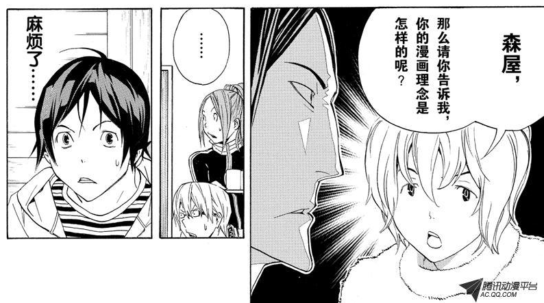
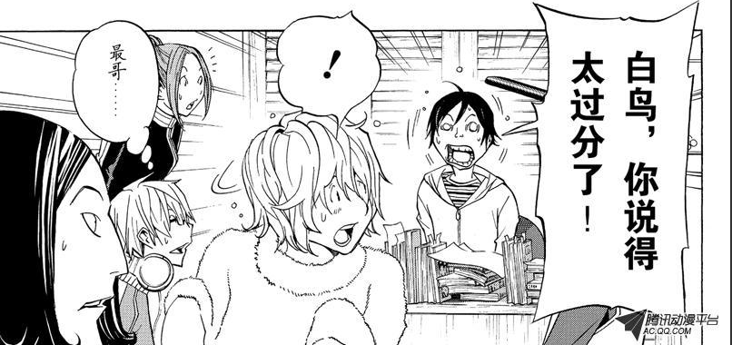
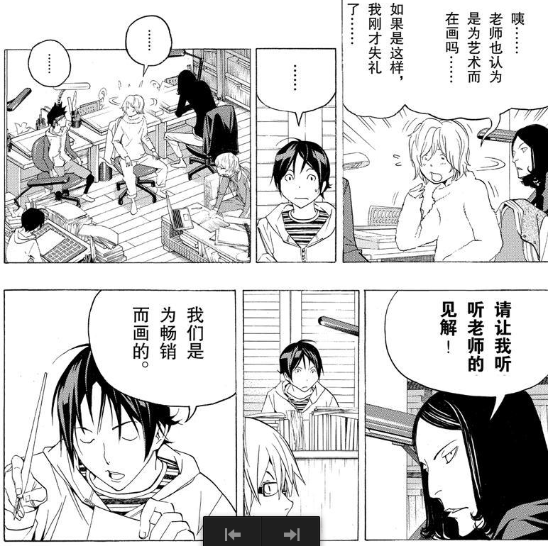
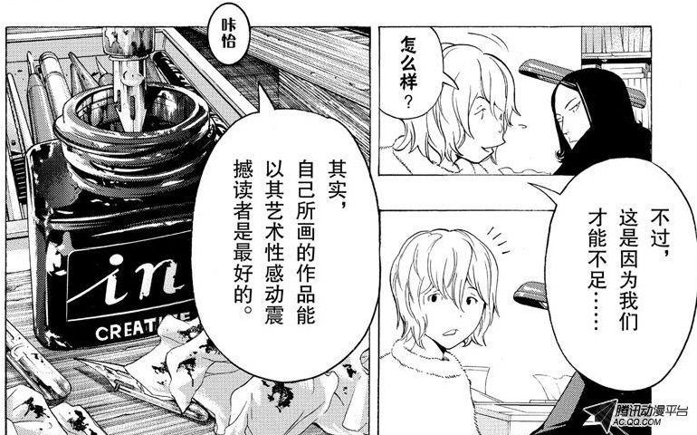
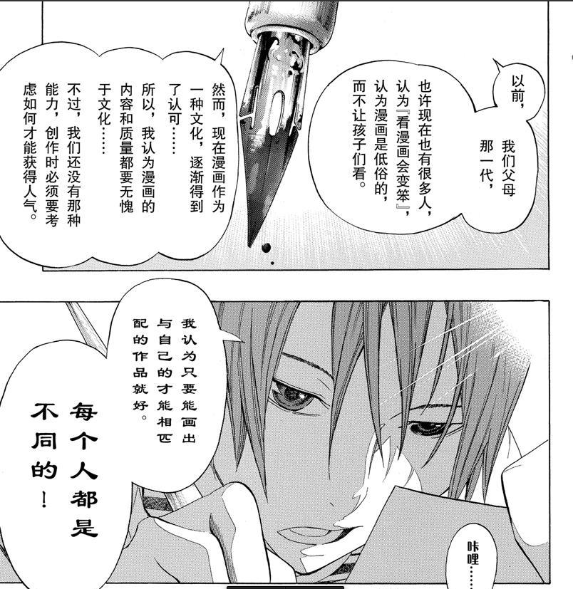
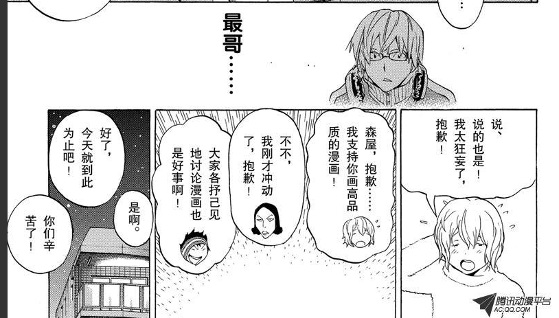

《爆漫王》笔记
==================

第 2 卷
-------

第 8 章
^^^^^^^^^^^^^

服部： 高木，你属于那种会思考怎么写才会受读者欢迎的人。

高木： 啊……是的。

服部：这或许只是我的个人想法，成功的漫画家，大致分为两类。

- 一种是尽情地画自己想画的、喜欢画的东西，然后热卖。
  说难听点这就是自我主义，说好听点就是天才型。

- 另一种就是像你这种类型，经过缜密的构思计算，推出热卖作品。

**画得出畅销作品的漫画家，绝大多数是未经过计算的人。**

服部：不好意思， 刚才我可能没有说清楚。 应该说靠分析计算，再创作漫画的做法，掌控起来难度比较高。反过来说，能靠分析计算推出畅销作品的人，才叫厉害。

第 11 章
^^^^^^^^^^^

编辑长：漫画只要有趣就好。有趣的漫画被连载，是理所当然的事情。

第 16 章
^^^^^^^^^^^

川口太郎：

JUMP 上的漫画，每周都用这张读者问卷调差做排名。

真正的成败论英雄，正因此，每周都会觉得自己像被推上擂台的拳击手。
我的心情有喜有忧，完全被这读者问卷调查所左右。
从第二名到第二十名我都得过，唯独第一名，一次也没得过。

哪怕是得上一次也好啊，夺得第一名看看是什么滋味。
那是我从连载开始就天天做的梦。

第 3 卷
----------

第 18 章
^^^^^^^^^^^^

服部：
听好，新人中的大部分都是画王道。
他们不是刻意画王道，而是因为他们只接触过电子游戏和王道漫画，所以才会画那种题材。
可是，高木你能写出非王道的故事，这是你的武器。

第 20 章
^^^^^^^^^^^

服部：

我毕竟是个编辑，能提的建议有限。

那些能做得比编辑要求的更多更好的人，才是优秀的漫画家。
你明白吧？

编辑保证不了写什么样的故事会畅销，说的极端一点，要是知道畅销作品创作的秘诀，自己画就好了。

**漫画家一定要超越编辑才行！**

第 22 章
^^^^^^^^^^^^^^^^^^^

福田：
新妻太缺乏职业漫画家的自觉。
如果只是想自己画得高兴，那么去画同人志就好啦。
可是，你是在 JUMP 上创作的职业漫画家，必须把如何让读者看得开心，当成第一要事。

真城：
你只靠天分就画得出来，对看过很多漫画的人来说，看你的漫画不过是看热闹，而在同时画漫画的人眼里，会觉得你很厉害……

福田：
是的！
“厉害”和“有趣”不同，读者如果不觉得故事有趣，作品就会人气大跌。

新妻：
唔……那我如何是好呢？

真城：
要画得简单易懂，让读者更能享受乐趣……

第 23 章
^^^^^^^^^^^^

福田：
不拿分镜稿给责任编辑看不行啊。
内容有没有趣，编辑凭什么判断啊？
因为麻烦而不画分镜稿，这种态度可以说是瞧不起职业漫画家这份工作。

----

福田：
反正不能只顾自己画得高兴，要设想读者的心情来创作。

新妻：
哦……读者的心情吗？

真城：
要让读者在兴奋中期待后续，在牵挂中担心剧情。

福田：
每一话都要惊醒设计故事情节的高潮，用能诱使读者继续阅读的印子收尾。

第 32 章
^^^^^^^^^^^^^

高木：
不过，立志当漫画家，结果是吉是凶，还不清楚哦。

亚豆：
怀抱梦想，努力追求，我想这本身不会带个人厄运。

第 5 卷
------------

第 35 章
^^^^^^^^^^^

港浦：
漫画能否受欢迎，不在于同别的作品比较，而在于作品本身是否有趣！

第 36 章
^^^^^^^^^^^^

港浦：
画漫画就一定要认为它会受读者欢迎。
如果创作者不是因为作品有趣而创作，其作品也绝对不可能有趣。
读者从你们的作品中获得乐趣，你们以此为乐，才会继续创作出令读者更喜欢的故事。

第 37 章
^^^^^^^^^^^^^

真城：
我想实现叔叔当年没有做到和没有完成的梦想。

鸟岛：
没有做到和没有完成的梦想？

真城：
他没有做到的是靠漫画活过一生。
没有完成的梦想是，在读者问卷调查中得到第一名。

鸟岛：
很有志气啊……

编辑长：
最有可能得到第一名的机会是连载的第一话。

真城：
不！

鸟岛 & 编辑长：
？

真城：
我要让作品成为人气漫画长期连载，得到第一名……无论要用多少年。

编辑长：
大家创作时，应该都是抱着这种想法的。

鸟岛：
嗯。
不要想着“可能性不会是零”，而是要认为“有无限的可能性”。
不要想着“总有一天”，而是要用行动将它变为现实！
某部电影里好像这么说过。

第 11 卷
-----------

第 20 章
^^^^^^^^^^^

.. image:: chp20/1.png

.. image:: chp20/3.png

