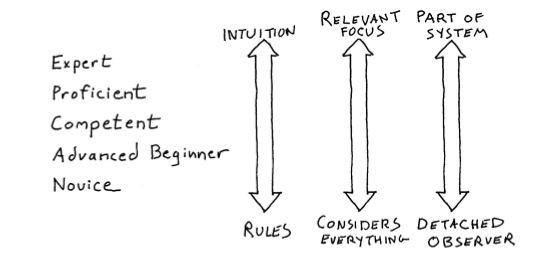

第二章：从新手到专家的例程
==============================

德雷福斯模型（Dreyfus model）的五个阶段
------------------------------------------------

德雷福斯兄弟定义了德雷福斯模型，
概括了从新手到专家必须经历的 5 个阶段，
包括：

1. 新手（novice）

2. 高级新手（advanced beginner）

3. 胜任者（competent）

4. 精通者（proficient）

5. 专家（expert）

他们的研究表明，
从新手到专家要经历巨大的变化。

在这个过程中，
人们不只是“获得了更多知识”，
或者学会了某些技术，
而且还在如何认识世界、
如何解决问题、
以及如何形成（form）和使用思维模型等方面体验到根本性的区别。
人们获取新技术的方式发生了改变，
影响（促进或阻碍）人们工作业绩的外部因素也发生了变化。

阶段一：新手
----------------

新手的表现如下：

1. 在该技能领域经验很少，或者根本没有经验。

2. 想要立即知道答案，是对还是错。

3. 不是特别想要学习，他们想要一个立竿见影的目标。

4. 不知道如何应付错误，出错会让对他们造成慌乱。

通过给新手一份指令清单（recipe），
指示“如果发生 X ，那么执行 Y ”，
他们的效率可以显著地提高。

但是这种问题的做法是，
有时候新手可能不知道执行哪条规则的效果才是最好的；
除此之外，
规则无法做到尽善尽美，
当事件的情况超出规则之外时，
新手就会不知所措。

阶段二：高级新手
-------------------

高级新手的表现如下：

1. 开始多多少少摆脱固定的规则，可以独自尝试任务，但仍然难以解决问题。

2. 想要快速获取信息。

3. 能够根据过去的经验，逐步在正确的情境中采纳建议，但比较吃力。

4. 开始形成一些总体原则，但不是“全貌”。

5. 没有全面理解能力，而且也不想有；如果试图将一个更大的情境强加给他们，那么他们可能会认为该情境和原则不相关，从而将情境忽略掉。

阶段三：胜任者
----------------

胜任者的表现如下：

1. 能够建立问题领域的概念模型，并有效地使用它们。

2. 可以独立解决自己遇到的问题，并开始考虑如何解决新问题 —— 那些他们之前没有遇到过的问题。

3. 开始寻求和运用专家的意见，并有效地利用。

4. 基于谨慎的计划和过去的经验来解决问题，如果没有更多的经验，在解决问题时他们将难以确定关注哪些细节。

胜任者通常在团队中发挥领导作用，
他们既可以指导新手，
也不会经常骚扰专家。

阶段四：精通者
------------------

精通者的表现如下：

1. 他们需要全局思维，围绕这个技术，寻找并想了解更大的概念模型，对于简单化的信息，他们会非常沮丧。

2. 能够矫正以往不好的工作表现，他们会反思以前是如何做的，并修改其做法，期待下次表现得更好。到了这个阶段，自我改进才会出现。

3. 学习他人的经验，从故事中认真学习，即使没有亲自参与。

4. 能够理解、并在情境下使用格言、经验之谈、诀窍、谚语，等等（比如， Don't Repeat Yourself）。

5. 拥有足够的经验，可以按情况采取适当的行动，并对情况进行预测。

6. 知道较低水平的从业者所不知道的高级技巧。

阶段五：专家
----------------

专家的表现如下：

1. 他们是各个领域知识和信息的主要来源。

2. 他们不断地寻找更好的方法和方式去做事。

3. 经验丰富，可以在恰当的情境中应用这些经验。

4. 根据直觉工作，而不需要理由。但是，他们通常很难解释清楚直觉（以及相关的结论）从何而来。

5. 擅长做有针对性的特征匹配：知道那些是无关紧要的细节，那些是非常重要的细节。

现实中的德雷福斯模型
---------------------------------

**当你在某个领域不是很擅长的时候，
你更可能认为自己是这方面的专家。**

缺少准确的自我评估，
被称为二阶不胜任（second-order incompetence），
也即是，不知道自己不知道。

一旦你真的称为了一名专家，
你会痛苦地意识到你知道的是多么少。

专家给新手制定规则，
可以帮助新手显著地提升业绩，
但是，
如果要求专家按自己所指定的规则来行动，
则反而会影响专家自己的表现。

直觉是专家的工具，
而新手则需要明确的指示。

从新手到专家，
最重要的三个变化：

研究似乎表明，
**大多数人的大多数技能，
在他们生命的大多数时间里，
从来没有高于第二阶段（高级新手）**\ ：
很多人只是执行他们需要做的任务并根据需要学习新任务，
但是从来没有对任务环境获得更广泛的、概念上的理解。

元认知（metacognitive）能力，
或者自我认知的能力，
往往在比较高的技能层次才会具有，
处于低水平的人常常高估他们自己的能力，
而正确自我评估的唯一办法就是提高个人技能层次，
这反过来又会提高元认知能力。

有效地使用德雷福斯模型
---------------------------

积极的实践需要以下四个条件：

1. 需要一个明确定义的任务

2. 任务需要有适当难度 —— 有挑战、但可行

3. 任务环境可以提供大量反馈，以便你采取行动

4. 提供重复犯错和纠正错误的机会

培养高级新手，
帮助他们把水平提高到胜任者层次。
有助于实现这个目标的主要方法是在环境中有好的榜样，
让高级新手通过观察和模仿高水平的人来学习。

新手需要梯子，
但是优胜者不会在乎失败者 —— 失败者会被团队抛弃。

编程专家必须持续编程，
并找到一个有意义的、有价值的职业生涯，
通过实践来维持专家水平。

考虑情境
----------

在进行判断时要将情境要考虑进去，
脱离情境的客观性存在固有危险。

举个例子，某种技术可能非常优秀，但如果你们团队里没有一个人了解这项技术，那么在使用这种技术之前就要三思而后行。

