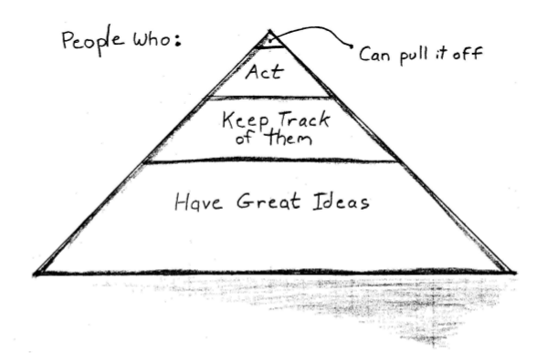

第三章：认识你的大脑
==========================

大脑的两种工作模式：

- **线性模式（L 模式，或者 L 型）**\ ：负责线性、逻辑思维和语言处理。相对缓慢，使用了大脑中相对较少的一部分资源。

- **富模式（R 模式，或者 R 型）**\ ：非线性、异步执行、综合处理。就像一个信号处理器，在“后台”计算，异步地返回结果。

R 型对直觉、问题解决和创造性非常重要。

L 型让你细致工作并实现目标。

两个模式互相干扰，不能同时使用。

.. note:: 

    本质上不存在左脑思维和右脑思维这样的东西，大脑的各种脑页和不同层次的结构体之间的协作分布得非常均匀。

    L 型和 R 型只是指大脑所拥有的两种不同的认知风格。

    这一概念在 Betty Edwards 的《Drawing on the Right Side of the Brain》中首次提出。

.. note::

    Linear 、Rich 和 Left 、Right 两个单词拥有同样的前缀字母只是巧合 —— L 型、 R 型理论和传统的左脑、右脑理论并不相同，前者是按功能区分的，而后者是按大脑的部位区分。

L 型
-------

L 型处理令人感到舒适、熟悉而轻松，它提供以下 9 种能力：

1. **语言能力** ： 使用词语来命令、描述和定义。

2. **分析能力** ： 有理有节分析事情。

3. **符号能力** ： 用符号表示事物。

4. **抽象能力** ： 抽取小部分信息（本质），并用其表示事物整体。

5. **时间能力** ： 遵时循序。

6. **推理能力** ： 基于理智和事实得到结论。

7. **数字能力** ： 使用数字计数。

8. **逻辑能力** ： 基于逻辑（定理、明确的论点）得出结论。

9. **线性思维能力** ： 按照关联、依序推演问题和思考，经常会得出收敛性结论。

R 型
-----------

R 型特点听起来有一些奇怪、不协调甚至非常不舒服：

1. **非语言** ： 可以获取语言，但是不能创建语言，它的思想无法通过语言来描述。

2. **综合** ： 集合事物形成总体。

3. **具体** ： 总是如实地反应事务。

4. **分析** ： 使用类比来评价事物直接的关系。

5. **非理性** ： 喜欢听好听的，而且不愿意为守时而费心。不受理性的约束，因为它不需要基于原因或者已知事实来处理输入 —— 因而，它完全愿意暂时不作任何判断。

6. **空间性** ： 喜欢弄清楚事物之间的空间关系，了解部分如何形成整体。

7. **直觉** ： 不用经过太多思考，很快就能出现的直接想法、感觉、信念或者偏好（来自\ `维基百科 <http://zh.wikipedia.org/wiki/%E7%9B%B4%E8%A6%BA_(%E7%9F%A5%E8%AD%98%E8%AB%96)>`_\ ）。

8. **全面** ： 注重整体，总是希望一次就能看到事物整体，感知整体的模式和结构。

9. **非线性** ： 直觉性的、跳跃性的思维，通常基于不完整的模式、直觉、归纳觉或者视觉影像来做判断。

从 L 型到 R 型
--------------------

我们需要更多地使用 R 型，
因为 R 型能提供直觉，
这是称为一名专家所迫切需要的。
没有它，
我们就不能称为专家。

R 型提供了强大的综合学习能力。

模式匹配是专家表现的一项关键能力，
而 R 型提供了这种能力。

如果你想发现全局、整体的模式，
你需要 R 型；如果你需要分析部分和细节，
你需要 L 型。

“非理性”并没有什么不对，
思维过程是非理性的或者不可重复的并不意味着它是不科学的、不负责任的、不合适的。

尽管 L 型思维方式的分析和语言能力带我们走了那么远，
但是我们已经因为过度依赖 L 型而失去了一些 R 型的重要能力。
为了前进，
为了推经人类发展的下一次革命，
我们需要学习将大大忽略的 R 型和 L 型重新集成。

.. note:: 处于被禁锢状态下，生物的脑细胞会受到影响。 —— Elizabeth Gould 的实验研究

.. note:: “真正想要了解一只青蛙，传统的解剖不是办法，更好的方式是构造一只青蛙。” —— 尼葛洛庞蒂，《Don't Dissect the Frog, Build It》。

例子 ：设计胜于功能
^^^^^^^^^^^^^^^^^^^^^^^^^^^

具有吸引力的用户界面要比不具吸引力（也即是，丑陋的）界面更易于使用，
尽管它们拥有相似的处理流程。

积极的情感对学习和创造性思维非常关键。
处于“高兴”的状态可以扩展你的思维过程，
激活更多的大脑物质。

与之相反，当你害怕或者生气时（充满了消极的情绪），
你的大脑开始停止提供多余的资源，
并未反抗或者逃跑做准备。

.. tip:: 争取好的设计，它真的很有效。

.. note:: “设计并不是创造美，美来自于选择、共鸣、同化和爱。” —— Louis Kahn

捕捉 R 型
--------------

R 型通常是不可预测的，
你需要为此做好准备。
答案和灵感会独立于你的意识活动出现，
而且不是总在恰当的时候。

这意味着每周 7 天每天 24 小时需要随时准备好记录任何灵感和想法，
不论当时在做什么。

一旦开始记录这些方向，
你就会得到更多。
如果不使用这种方法，
大脑就会停止向你提供东西。
但是如果你开始使用它，
大脑就会非常乐意给给你提供比你想要的更多的东西。

每个人 —— 不论教育背景、经济状况如何，
不论日常工作是什么，
不论年纪大小 —— 都有好想法。
但是在这么多拥有好想法的人中，
只有少数人在努力跟踪它们。
而其中，又只有更少数人会努力辅助行动。
随后，仅有少之又少的人有能力将好想法成功实现。

要想达到下图的最顶层，必须跟踪好想法，这是最基本的要求：

脑部的可重塑性
-----------------

直到最近，
人们还相信大脑的功能和内部“关联”从我们一出生就固定了。
也就是说，
大脑的各个局部趋于根据确定的规则执行相应的功能。
一部分皮层处理视觉输入，
另一部分处理味觉，等等。
这也意味着你所具有的做事能力和智力在出生时就基本确定了，
没有另外的训练或者开发可以使你超越着这个极限。

幸运的是，这种观点实际上是错误的 —— 人类大脑非常具有可塑性。

神经可塑性（大脑的可塑本质）也意味着你能够学习的最大容量或者你可以获得的技能数量不是固定的。
没有上限，
只要你相信这一点。

持续使用和时间的技能会组建占据大脑皮层中的统治地位，
这样一来，
大脑里就会有更多的部位被关联起来。

同时，
较少使用的技能会失去阵地。
“不使用就会失去”，
这句话用在这里可谓恰如其分，
因为大脑会把更多的资源用于你做得更多的事情。
